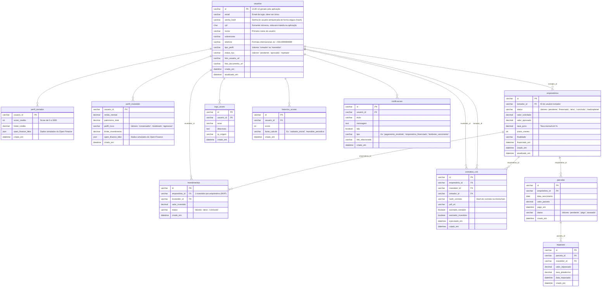

# 2. Design e Desenvolvimento da Aplicação

Esta seção (2) tem como objetivo apresentar, de forma clara e estruturada, as decisões de design de experiência do usuário (UX/UI) e as etapas técnicas de desenvolvimento que deram forma ao NexPeer, aplicativo mobile desenvolvido para a QI Tech. A solução foi concebida para permitir transações financeiras peer-to-peer (P2P) de maneira intuitiva, segura e eficiente, refletindo os princípios da empresa: inovação tecnológica, conformidade regulatória, usabilidade e confiabilidade no setor financeiro.

O processo de design priorizou uma jornada de usuário simplificada, com fluxos claros para cadastro, autenticação, envio e recebimento de valores. Paralelamente, o desenvolvimento seguiu uma arquitetura modular e escalável, contemplando a modelagem do banco de dados, a implementação de uma WebAPI RESTful para comunicação entre cliente e servidor, e a integração com serviços essenciais, como autenticação segura, validação de contas e processamento de transações.

Além disso, são detalhados os componentes-chave do sistema, incluindo as camadas de persistência, lógica de negócio e interface, permitindo compreender como cada parte se conecta e opera de forma integrada para entregar uma experiência fluida e segura ao usuário final.

O objetivo desta parte da documentação é oferecer uma visão abrangente do processo de construção do NexPeer, destacando tanto as escolhas de design centradas no usuário quanto as boas práticas de engenharia de software adotadas durante o desenvolvimento, garantindo assim funcionalidade, desempenho, manutenibilidade e alinhamento com os mais altos padrões do mercado financeiro digital.

<div style={{ display: 'grid', gridTemplateColumns: '1fr 1fr', gap: '16px' }}>
  <a href="#tecnologias-utilizadas" style={{ textDecoration: 'none' }}>
    <div style={{ padding: '16px', border: '1px solid #5e5c5cff', borderRadius: '8px',}}>
      <h3>Tecnologias utilizadas</h3>
      <p>Ferramentas e frameworks usados no NexPeer.</p>
    </div>
  </a>

  <a href="#arquitetura" style={{ textDecoration: 'none' }}>
    <div style={{ padding: '16px', border: '1px solid #5e5c5cff', borderRadius: '8px',}}>
      <h3>Arquitetura</h3>
      <p>Estrutura MVC modular e escalável.</p>
    </div>
  </a>

  <a href="#protótipo-de-alta-fidelidade" style={{ textDecoration: 'none' }}>
    <div style={{ padding: '16px', border: '1px solid #5e5c5cff', borderRadius: '8px',}}>
      <h3>Protótipo de Alta Fidelidade</h3>
      <p>Simulação da experiência real do usuário.</p>
    </div>
  </a>

  <a href="#modelagem-de-banco-de-dados" style={{ textDecoration: 'none' }}>
    <div style={{ padding: '16px', border: '1px solid #5e5c5cff', borderRadius: '8px',}}>
      <h3 style={{ fontSize: '19px' }}>Modelagem de Banco de Dados</h3>
      <p>Organização de dados para usuários, empréstimos e contratos.</p>
    </div>
  </a>

  <a href="#webapi-e-endpoints" style={{ textDecoration: 'none', }}>
    <div style={{ padding: '16px', border: '1px solid #5e5c5cff', borderRadius: '8px',}}>
      <h3>WebAPI e Endpoints</h3>
      <p>Comunicação segura entre front-end, back-end e blockchain.</p>
    </div>
  </a>

</div>

## 2.1. Tecnologias utilizadas {#tecnologias-utilizadas}
Esta subseção (2.1) detalha o conjunto de ferramentas, frameworks e serviços escolhidos para o desenvolvimento do NexPeer. As decisões técnicas foram orientadas pelos critérios de segurança, escalabilidade, facilidade de manutenção e alinhamento com as boas práticas do mercado financeiro digital.

- **Aplicação Web (Full-Stack): Next.js 14+ (com React):** Escolhemos Next.js por ser um framework full-stack robusto que nos permite construir tanto a interface do usuário (com React) quanto a nossa API de backend no mesmo projeto. Essa abordagem monolítica simplifica o desenvolvimento e o deploy, eliminando a necessidade de gerenciar repositórios e infraestruturas separadas. Utilizamos o App Router, que otimiza a performance com Server Components por padrão e nos dá um controle granular sobre a renderização no cliente. Para garantir a segurança e a qualidade do código em uma aplicação financeira complexa, adotamos o TypeScript, que nos fornece tipagem estática para prevenir bugs, facilitar a manutenção e habilitar um autocompletar inteligente em todo o projeto.
- **Banco de Dados:** 
PostgreSQL, hospedado no Supabase: por oferecer suporte a queries complexas, boa performance e integração facilitada com serviços modernos de backend-as-a-service.
- **Interação com o Banco de Dados: Prisma ORM**
O Prisma atua como a nossa camada de acesso a dados (Model), permitindo-nos escrever consultas ao banco de dados de forma segura e em TypeScript, o que acelera o desenvolvimento e previne erros.
- **Ferramentas de Apoio:** 
   - Git e GitHub para versionamento e colaboração em equipe 
   - Figma para prototipagem e design de interfaces.

## 2.2. Arquitetura {#arquitetura} 
Esta subseção (2.2) detalha a arquitetura do NexPeer, que foi desenvolvida seguindo o padrão **Model-View-Controller (MVC)** para garantir uma estrutura clara, modular e escalável. O uso desse padrão permite separar as responsabilidades do sistema em três componentes principais, de modo a facilitar a manutenção e o desenvolvimento colaborativo. Esta arquitetura, complementada por camadas de serviço e repositório, assegura a organização do código e a flexibilidade para futuras alterações (BARBOSA, 2021).

* **Camadas da Arquitetura:**
    * **View (Front-end):** 
     Desenvolvida em React, esta camada é a interface com a qual o usuário interage diretamente. Ela exibe os dados e captura as ações do usuário, como cliques e preenchimento de formulários, enviando-os para o Controller. A View é a camada de apresentação, focada na experiência do usuário (UX/UI).
    * **Controller:** 
     Responsável por receber as requisições da View, ele atua como intermediário, validando os dados e coordenando as operações entre a View e o Service. O Controller não contém a lógica de negócios, apenas direciona as chamadas para a camada de Service apropriada. Implementado com as Next.js API Routes dentro da pasta src/app/api/. Atua como o intermediário: recebe as requisições da View, valida os dados e chama a camada de Serviço (Model) para executar a lógica de negócio.
    * **Service:** 
     Esta camada é o responsável pela lógica de negócios da aplicação. Ela agrupa as regras de negócio complexas, como validações de transações, cálculos de saldo e verificação de segurança (antifraude). O Service utiliza o Repository para acessar e manipular os dados, garantindo que a lógica de negócios esteja separada do banco de dados.
    * **Repository:** 
      O Repository é a camada que conversa diretamente com o banco de dados. Ele interage diretamente com o banco de dados PostgreSQL, contendo as consultas SQL e as operações de CRUD (Create, Read, Update, Delete). A grande vantagem é que ele serve como uma ponte clara para a camada de Service, isolando a lógica de negócios de como e onde os dados estão guardados.
    * **Model:** 
     Representa a estrutura de dados e as entidades do sistema. Os Models definem os campos e relacionamentos, garantindo a integridade e a consistência dos dados em todas as camadas.

## 2.3. Protótipo de Alta Fidelidade {#protótipo-de-alta-fidelidade}

## 2.4. Modelagem de Banco de Dados {#modelagem-de-banco-de-dados}
Esta subseção (2.4) descreve a estrutura do banco de dados do NexPeer, projetada para ser a base robusta e escalável da nossa plataforma. A modelagem foi pensada para garantir a integridade dos dados e a eficiência nas operações financeiras, além de facilitar a rastreabilidade e a auditoria de todas as transações. Adotamos um modelo relacional que organiza as informações de forma lógica e interconectada, permitindo que a aplicação funcione de maneira fluida e segura.

### 2.4.1. Modelo Relacional
Para facilitar a visualização e o entendimento, disponibilizamos o diagrama de entidade-relacionamento (DER) em um formato gráfico.



A tabela `usuarios` serve como o núcleo da base de dados, contendo as informações essenciais de todos os usuários, como nome, email e CPF. O campo `tipo_perfil` determina se o usuário é um 'tomador' ou um 'investidor', vinculando-o a tabelas de perfil dedicadas (`perfil_tomador` e `perfil_investidor`) que armazenam dados específicos, como **score de crédito** ou **renda mensal**.

As operações de empréstimo e investimento são gerenciadas pelas tabelas `emprestimos` e `investimentos`, que registram as solicitações dos tomadores e conectam o investidor ao empréstimo que ele apoiou. Para administrar os pagamentos, a tabela `parcelas` armazena as obrigações do tomador, enquanto a tabela `repasses` registra os pagamentos líquidos enviados aos investidores.

Para garantir a conformidade e a segurança, a tabela `contratos_ccb` armazena os registros dos contratos, assegurando a validade jurídica das operações. Adicionalmente, a tabela `logs_acoes` funciona como um sistema de auditoria, registrando as ações importantes dos usuários para fins de rastreabilidade. Finalmente, para aprimorar a experiência do usuário, a tabela `historico_scores` armazena o histórico da pontuação de crédito, e a tabela `notificacoes` é responsável por enviar alertas e confirmações importantes.

### 2.4.2. Consultas SQL

## 2.5. WebAPI e Endpoints {#webapi-e-endpoints}
Esta subseção (2.5) mostra como a aplicação se conecta à WebAPI e aos serviços externos que sustentam o funcionamento da aplicação, incluindo a comunicação com a blockchain. O objetivo é explicar de forma clara como os endpoints disponibilizam funcionalidades essenciais, como cadastro de usuários, solicitação de empréstimos, investimentos e execução de contratos financeiros peer-to-peer (P2P).

A integração com a blockchain, através de smart contracts, garante que os contratos sejam registrados de forma imutável e auditável, oferecendo segurança jurídica e transparência nas transações. Nesta subseção, apresentamos o contrato principal utilizado no MVP e mostramos como ele se conecta à aplicação.

## 2.5.1 Integração com Smart Contract

&emsp; O contrato principal do MVP é o `SimpleP2PLoan`, que gerencia empréstimos entre tomadores e investidores, controlando valores, taxas, prazos e pagamentos. A seguir, é detalhado o funcionamento do contrato.

### Smart Contract `SimpleP2PLoan`

```solidity
// SPDX-License-Identifier: MIT
pragma solidity ^0.8.0;

contract SimpleP2PLoan { 
    address public borrower; 
    address public lender; 
    uint256 public principal; 
    uint256 public monthlyRate; 
    uint256 public termMonths;
    bool public isActive = true; 

    event LoanCreated(address borrower, address lender, uint256 principal, uint256 rate, uint256 term);

    constructor(
        address _borrower,
        uint256 _principal,
        uint256 _monthlyRate,
        uint256 _termMonths
    ) payable {
        require(msg.value == _principal, "Value must match loan amount"); 
        require(_termMonths == 6 || _termMonths == 12 || _termMonths == 24, "Invalid term");

        borrower = _borrower;
        lender = msg.sender;
        principal = _principal;
        monthlyRate = _monthlyRate;
        termMonths = _termMonths;

        payable(_borrower).transfer(_principal);

        emit LoanCreated(_borrower, msg.sender, _principal, _monthlyRate, _termMonths);
    }

    function repay() external payable {
        require(msg.sender == borrower, "Only borrower can repay");
        payable(lender).transfer(msg.value);
    }
}
```
#### Variáveis públicas
- **borrower** e **lender**: armazenam os endereços Ethereum do tomador e do investidor.  
- **principal**: valor total do empréstimo.  
- **monthlyRate**: taxa de juros mensal, que pode ser baseada no score de crédito do tomador.  
- **termMonths**: prazo do empréstimo em meses.  
- **isActive**: indica se o contrato ainda está em vigor.  

#### Eventos
- **LoanCreated**: emitido na criação do contrato, registra o empréstimo na blockchain. Eventos permitem que o front-end ou outros serviços externos monitorem transações de forma confiável.  

#### Construtor
- Executado apenas uma vez na criação do contrato.  
- Valida que o valor enviado corresponde ao empréstimo e que o prazo é válido (6, 12 ou 24 meses).  
- Inicializa as variáveis e transfere o valor para o tomador.  
- Emite o evento **LoanCreated**.  

#### Função `repay`
- Permite que o tomador pague de volta o empréstimo diretamente ao investidor.  
- Valida que apenas o tomador pode executar a função.  
- Transferência é feita automaticamente para o investidor.  

A utilização da blockchain no NexPeer traz diversos benefícios estratégicos e operacionais. Por ser uma tecnologia distribuída e imutável, ela garante que todas as transações realizadas por meio dos contratos P2P sejam registradas de forma segura e auditável, sem possibilidade de alteração posterior. Isso aumenta a confiança entre tomadores e investidores, pois cada empréstimo e cada pagamento ficam registrados de forma transparente e permanente. (GONZALEZ, 2025)

Além disso, a blockchain permite a automação de processos críticos por meio de smart contracts, reduzindo a necessidade de intervenção manual e minimizando erros ou fraudes. A execução automática de contratos financeiros, como a liberação de valores e o repasse de pagamentos, proporciona maior eficiência operacional e agilidade na experiência do usuário.  

Outro ponto importante é a segurança jurídica: ao registrar os contratos na blockchain, o NexPeer garante um histórico verificável das transações, o que fortalece a conformidade regulatória e a proteção dos participantes da plataforma (THE COMPLIANCE DIGEST, 2024). 

A integração do NexPeer com a blockchain, através de smart contracts como o `SimpleP2PLoan`, representa um passo fundamental para combinar tecnologia financeira de ponta com segurança, transparência e confiabilidade. Essa abordagem assegura que todas as operações P2P sejam rastreáveis, automatizadas e auditáveis, oferecendo uma experiência segura tanto para tomadores quanto para investidores, alinhada aos padrões do mercado financeiro digital.